# Fault-Tolerant App

This repository contains a fault-tolerant, full-stack application built using a serverless architecture. The system simulates a data processing pipeline where users submit tasks via a frontend, and a robust backend processes these tasks asynchronously using AWS services. Real-time task status updates are provided via a WebSocket API.

## 📋 Table of Contents

- [Fault-Tolerant App](#fault-tolerant-app)
  - [📋 Table of Contents](#-table-of-contents)
  - [🌟 Overview](#-overview)
  - [🏗 Architecture](#-architecture)
  - [⚙️ Setup Instructions](#️-setup-instructions)
    - [Backend Setup](#backend-setup)
    - [Frontend Setup](#frontend-setup)
  - [🧪 Testing Instructions](#-testing-instructions)
    - [Backend Testing](#backend-testing)
    - [Frontend Testing](#frontend-testing)
  - [🛠️ Assumptions \& Challenges](#️-assumptions--challenges)
    - [Assumptions](#assumptions)
    - [Challenges](#challenges)

## 🌟 Overview

The application is split into two main parts:

- **Frontend:** An Angular 15 application using NGXS for state management, which allows users to submit tasks and view live updates.
- **Backend:** A Node.js serverless application deployed using the Serverless Framework on AWS. It leverages AWS Lambda, API Gateway (REST and WebSocket), SQS, DynamoDB, and CloudWatch for logging and monitoring. Tasks are processed asynchronously with fault-tolerant retry logic and real-time updates pushed via a WebSocket API.

## 🏗 Architecture
**Architecture Diagram:**

```mermaid
graph TD
    subgraph Frontend[Frontend - Angular]
        UI[🌐 User Interface]
        WS[🔌 WebSocket Client]
    end

    subgraph Backend[Backend - Serverless]
        API[🚪 API Gateway]
        Lambda[⚡ Lambda Functions]
        DB[(🗄️ DynamoDB)]
        Queue[📬 SQS Queue]
        DLQ[⚠️ Dead Letter Queue]
    end

    UI -->|HTTP Requests| API
    UI -->|WebSocket| WS
    WS -->|Connect/Updates| API
    API --> Lambda
    Lambda --> DB
    Lambda --> Queue
    Queue --> Lambda
    Queue -->|Failed Tasks| DLQ
    DLQ --> Lambda

    style Frontend fill:#e3f2fd,stroke:#0d47a1,stroke-width:2px,color:#000000
    style Backend fill:#f1f8e9,stroke:#33691e,stroke-width:2px,color:#000000

    style UI fill:#bbdefb,stroke:#0d47a1,stroke-width:2px,color:#000000
    style WS fill:#bbdefb,stroke:#0d47a1,stroke-width:2px,color:#000000

    style API fill:#ffe0b2,stroke:#ef6c00,stroke-width:2px,color:#000000
    style Lambda fill:#fff9c4,stroke:#f9a825,stroke-width:2px,color:#000000
    style DB fill:#c8e6c9,stroke:#2e7d32,stroke-width:2px,color:#000000
    style Queue fill:#d1c4e9,stroke:#673ab7,stroke-width:2px,color:#000000
    style DLQ fill:#ffcdd2,stroke:#c62828,stroke-width:2px,color:#000000
```

**Key Components:**

- **Frontend (Angular):**
  - Task submission form and dashboard.
  - Uses NGXS for state management.
  - Receives real-time task status updates via a WebSocket client.

- **Backend (Serverless):**
  - **AWS Lambda:** Executes functions for task submission, processing, and WebSocket connection management.
  - **AWS API Gateway (REST):** Exposes HTTP endpoints for task submission and fetching tasks.
  - **AWS SQS:** Buffers tasks for asynchronous processing.
  - **AWS SQS Dead Letter Queue (DLQ):** Handles failed tasks after multiple retries.
  - **AWS DynamoDB:** Stores task details and active WebSocket connection IDs.
  - **AWS API Gateway (WebSocket):** Provides real-time push updates to connected clients.
  - **CloudWatch:** Aggregates logs and monitors function performance.


**Supporting Infrastructure:**

- **AWS IAM (Identity and Access Management):**
  - Manages permissions and access control for all AWS services
  - Ensures secure communication between components
  - Controls resource access through role-based policies

- **AWS CloudFormation:**
  - Manages infrastructure as code
  - Handles stack deployment and updates
  - Maintains consistent environment configuration

- **Environment Configuration:**
  - Lambda environment variables for service configuration
  - WebSocket endpoint management
  - Service connection details

## ⚙️ Setup Instructions

### Backend Setup

1. **Prerequisites:**
   - Node.js (v14+)
   - AWS CLI configured with credentials
   - Serverless Framework CLI v3 (`npm install -g serverless@3`)

2. **Installation & Deployment:**
   ```bash
   cd backend
   npm install
   npm run deploy
   ```
**NOTE**: `npm run deploy` script runs both `serverless deploy --stage dev` and the `update-websocket`, that updates the WS endpoint in the Lambda functions.

3. **Post-Deployment:** If necessary, update the WebSocket endpoint in your Lambda functions:
   ```bash
   npm run update-websocket
   ```

4. **Endpoints:** After deployment, note the printed REST endpoints and the WebSocket endpoint.

### Frontend Setup

1. **Prerequisites:**
   - Node.js (v14+)
   - Angular CLI (`npm install -g @angular/cli`)

2. **Installation**
   ```bash
   cd frontend
   npm install
   ```

3. **Configuration:** Edit `src/environments/environment.ts` (and `environment.prod.ts` for production) to update:
   - `apiUrl`: the REST API endpoint from your backend.
   - `websocketUrl`: (if used) your WebSocket endpoint.

4. **Running the Application:**
   ```bash
   ng serve
   ```

   Open your browser at http://localhost:4200.

## 🧪 Testing Instructions

### Backend Testing

### Frontend Testing

1. Navigate to the frontend directory:
   ```bash
   cd frontend
   ```
2. Run tests:
   ```bash
   ng test
   ```
This will run your NGXS state tests and component tests.

## 🛠️ Assumptions & Challenges

### Assumptions

- **AWS Environment**
    
    We assume that AWS user roles and policies are configured correctly and securely for all services.

- **Real-Time Updates**
    
    I chose to implement a WebSocket API over polling. This decision was made because WebSockets provide instant updates to multiple users and scale more efficiently, especially when tasks are frequently updated or processed in real time.

- **Serverless Framework Version**
    
    We are using Serverless Framework v3 because v4 requires a proper login and license/account setup, which we assume is not available in our current environment.

- **Angular Version**
    
    We are using Angular version 15. Due to legacy peer dependency issues, a standard npm install required some adjustments.

- **Backend Implementation**
    
    I opted for plain Node.js as our backend handler to keep the implementation simple and focused on demonstrating fault-tolerance and serverless capabilities, rather than using a heavier framework.

### Challenges

- **CORS Configuration**
    
    I encountered CORS issues during development, which were resolved after careful configuration of API Gateway and Lambda responses.

- **Serverless Version Constraints**
    
    Downgrading to Serverless v3 was necessary due to licensing/login requirements in v4. This was a workaround to ensure a smooth deployment process.

- **Angular Peer Dependencies**
    Working with an older version of Angular (v15) introduced legacy peer dependency issues that required manual resolution for a successful installation.

